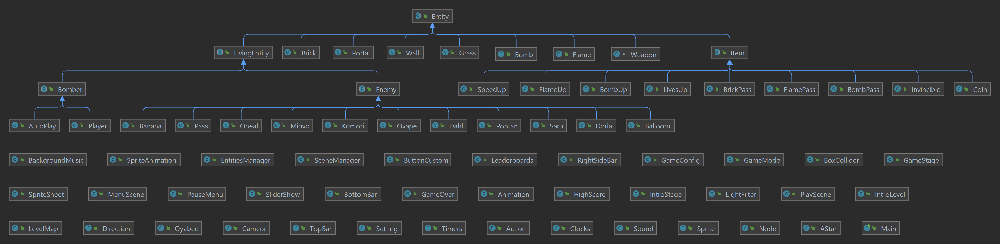

<a name="readme-top"></a>

<!-- PROJECT SHIELDS
[![Contributors][contributors-shield]][contributors-url]
[![Forks][forks-shield]][forks-url]
[![Stargazers][stars-shield]][stars-url]
[![Issues][issues-shield]][issues-url]
[![MIT License][license-shield]][license-url] -->

<!-- PROJECT LOGO -->
<br />
<div align="center">
  <a href="https://github.com/dat-roy/Bomberman-OOP.git">
    
  </a>
  <h1>BOMBERMAN GAME</h1>
  <h2>Bài tập lớn Lập trình hướng đối tượng</h2>
  <h3>Nhóm 7 - INT2204 20 - Kì 1 (2022-2023)</h3>

  <a href="https://www.youtube.com/watch?v=w63WtuqQORM">View Demo Player</a>

  <a href="https://www.youtube.com/watch?v=X66kX0T9RpI">View Demo Auto Play</a>

  <a href="https://github.com/dat-roy/Bomberman-OOP/issues">Report bug</a>
  <br />
</div>

<!-- TABLE OF CONTENTS -->
<details>
  <summary><b>Table of Contents</b></summary>
  <ol>
    <li>
      <a href="#intro">Giới thiệu</a>
      <ul>
        <li><a href="#members">Thành viên nhóm</a></li>
        <li><a href="#about-the-project">Tổng quan dự án</a></li>
        <li><a href="#tech">Các kỹ thuật lập trình</a></li>
      </ul>
    </li>
    <li>
      <a href="#description">Mô tả trò chơi</a>
    </li>
    <li><a href="#feature">Chức năng mở rộng</a></li>
    <li><a href="#diagram">Biểu đồ lớp UML</a></li>
    <li><a href="#conclusion">Hướng phát triển</a></li>
  </ol>
</details>

## Giới thiệu <a name="intro"/>
### Thành viên nhóm <a name="members"/>
- [Trần Đức Vinh - MSV 21020098](https://github.com/TORIOP23)
- [Lê Viết Đạt - MSV 21020298](https://github.com/dat-roy)
- [Nguyễn Ngọc Huy - MSV 21020765](https://github.com/huy165273)

### Tổng quan dự án <a name="about-the-project"/>
Xây dựng bởi Java, Maven, Javafx
- [Java11](https://www.oracle.com/java/technologies/javase/jdk11-archive-downloads.html)
- [JavaFx](https://openjfx.io/openjfx-docs/)

### Các kĩ thuật lập trình đã sử dụng <a name="tech"/>
``` bash
- Lập trình hướng đối tượng
- Singleton design pattern
- Thuật toán BFS
```

## Mô tả trò chơi <a name="description"/>
Nếu bạn đã từng chơi Bomberman, bạn sẽ cảm thấy quen thuộc với những đối tượng này. Chúng được được chia làm hai loại chính là nhóm đối tượng động (*Bomber*, *Monster*, *Bomb*) và nhóm đối tượng tĩnh (*Grass*, *Wall*, *Brick*, *Portal*, *Item*).
-  *Bomber* là nhân vật chính của trò chơi. Bomber có thể di chuyển theo 4 hướng trái/phải/lên/xuống theo sự điều khiển của người chơi.
-  *Enemy* là các đối tượng mà Bomber phải tiêu diệt hết để có thể qua Level. Enemy có thể di chuyển ngẫu nhiên hoặc tự đuổi theo Bomber tùy theo loại Enemy. Các loại Enemy sẽ được mô tả cụ thể ở phần dưới.
-  *Bomb* là đối tượng mà Bomber sẽ đặt và kích hoạt tại các ô Grass. Khi đã được kích hoạt, Bomber và Enemy không thể di chuyển vào vị trí Bomb. Tuy nhiên ngay khi Bomber vừa đặt và kích hoạt Bomb tại ví trí của mình, Bomber có một lần được đi từ vị trí đặt Bomb ra vị trí bên cạnh. Sau khi kích hoạt 2s, Bomb sẽ tự nổ, các đối tượng *Flame* được tạo ra.
-  *Grass* là đối tượng mà Bomber và Monster có thể di chuyển xuyên qua, và cho phép đặt Bomb lên vị trí của nó
-  *Wall* là đối tượng cố định, không thể phá hủy bằng Bomb cũng như không thể đặt Bomb lên được, Bomber và Monster không thể di chuyển vào đối tượng này
-  *Brick* là đối tượng được đặt lên các ô Grass, không cho phép đặt Bomb lên nhưng có thể bị phá hủy bởi Bomb được đặt gần đó. Bomber và Monster thông thường không thể di chuyển vào vị trí Brick khi nó chưa bị phá hủy.
-  *Portal* là đối tượng được giấu phía sau một đối tượng Brick. Khi Brick đó bị phá hủy, Portal sẽ hiện ra và nếu tất cả Monster đã bị tiêu diệt thì người chơi có thể qua Level khác bằng cách di chuyển vào vị trí của Portal.

Các *Item* cũng được giấu phía sau Brick và chỉ hiện ra khi Brick bị phá hủy. Bomber có thể sử dụng Item bằng cách di chuyển vào vị trí của Item. Thông tin về chức năng của các Item được liệt kê như dưới đây:

-  *SpeedUp*: Khi sử dụng Item này, Bomber sẽ được tăng vận tốc di chuyển thêm một giá trị thích hợp
-  *FlameUp*: Item này giúp tăng phạm vi ảnh hưởng của Bomb khi nổ (độ dài các Flame lớn hơn)
-  *BombUp*: Thông thường, nếu không có đối tượng Bomb nào đang trong trạng thái kích hoạt, Bomber sẽ được đặt và kích hoạt duy nhất một đối tượng Bomb. Item này giúp tăng số lượng Bomb có thể đặt thêm một.
-  *LivesUp*: Khi sử dụng Item này, Bomber sẽ được tăng 1 mạng.
-  *BrickPass*: Khi sử dụng Item này, Bomber sẽ có khả năng đi qua *Brick* trong 45s.
-  *FlamePass*: Khi sử dụng Item này, Bomber sẽ có khả năng đi qua *Flame* trong 45s.
-  *BombPass*: Khi sử dụng Item này, Bomber sẽ có khả năng đi qua *Bomb* trong 45s.
-  *Invincible*: Khi sử dụng Item này, Bomber sẽ bất tử trong 30s.
-  *Coin*: Sau khi người chơi vượt qua màn, tất cả Brick chưa bị phá hủy sẽ hóa thành Coin trong 15s, nhiệm vụ của người chơi là di chuyển ăn nhiều Coin nhất có thể. Ăn 1 coin người chơi sẽ được cộng 100 điểm.

Có nhiều loại Enemy trong Bomberman:

|                    Ảnh                    |    Tên     |                                                                                                                                        Mô tả                                                                                                                                        | Điểm  |     
|:-----------------------------------------:|:----------:|:-----------------------------------------------------------------------------------------------------------------------------------------------------------------------------------------------------------------------------------------------------------------------------------:|:-----:|
|  | *Balloom*  |                                                                                                          Là Enemy đơn giản nhất, di chuyển ngẫu nhiên với vận tốc cố định.                                                                                                          |  100  |
|    |  *Oneal*   |                                                                  Có tốc độ di chuyển thay đổi, lúc nhanh, lúc chậm và di chuyển "thông minh" hơn so với Balloom. Nó sẽ di chuyển về phía Bomber khi anh ta ở gần.                                                                   |  200  |
|     |   *Dahl*   |                                               Tốc độ hơi nhanh, có động tác nảy, không thông minh, thậm chí kém thông minh hơn Ballom không cố gắng đuổi theo Bomber, thích di chuyển từ trái sang phải, đôi ki di chuyển lên xuống.                                                |  400  |
|    |  *Minvo*   |                                                                                                    Di chuyển như Oneal, bắt gặp sau Dahl. Thường sẽ truy đuổi Bomber nếu ở gần.                                                                                                     |  800  |
|    |  *Doria*   |                                                                                             Nó có thể di chuyển qua các Brick, di chuyển chậm, thông minh, nó có thể đuổi theo Bomber.                                                                                              | 1000  |
|    |  *Ovape*   |                                                                                                             Đi qua Brick, không đuổi Bomberman, có khả năng vượt Wall.                                                                                                              | 2000  |
|     |   *Pass*   |                                                                                      Di chuyển nhanh hơn hầu hết kẻ thù, ngoại trừ Pontan, nhanh hơn và nguy hiểm hơn, tránh bom, đuổi Bomber.                                                                                      | 4000  |
|   |  *Pontan*  |                                                                                                          Di chuyển rất nhanh, đi qua các Brick, liên tục truy đuổi bomber.                                                                                                          | 8000  |
|   |  *Banana*  |                                                                                                    Di chuyển khắp không gian, bị điều khiển bởi Saru. Banana có sinh lực 100HP.                                                                                                     | 2000  |
|     |   *Saru*   | Xuất hiện ở khu vực cuối cùng, là cận vệ của Komori. Hắn điều khiển các quái vật Banana đi canh gác khắp nơi.<br/> Khi Bomberman xuất hiện trong tầm nhìn, hắn sẽ chạy lại và thủ tiêu ngay.<br/> Tuy nhiên, khi tất cả Banana bị đánh bại, hắn sẽ không dám di chuyển (vì sợ hãi). | 10000 |
|   | *Komori*   |                                    Là một loài dơi tinh đang quấy phá thế giới. Hắn có thể vỗ cánh và phát ra những tia lửa xanh về phía Bomberman. Cách duy nhất để tiêu diệt hắn là nổ bomb khi hắn đang đứng yên (vì vốn dĩ hắn có thể bay). | 20000 |

### Mô tả game play, xử lý va chạm và xử lý bom nổ

- Trong một màn chơi, Bomber sẽ được người chơi di chuyển, đặt và kích hoạt Bomb với mục tiêu chính là tiêu diệt tất cả Enemy và tìm ra vị trí Portal để có thể qua màn mới
- Bomber sẽ bị giết khi va chạm với Enemy hoặc thuộc phạm vi Bomb nổ. Lúc đấy Bomber bị trừ 1 mạng, khi Bomber hết mạng trò chơi kết thúc.
- Enemy bị tiêu diệt khi thuộc phạm vi Bomb nổ
- Một đối tượng thuộc phạm vi Bomb nổ có nghĩa là đối tượng đó va chạm với một trong các tia lửa được tạo ra tại thời điểm một đối tượng Bomb nổ.

- Khi Bomb nổ, một Flame trung tâm tại vị trí Bomb nổ và bốn Flame tại bốn vị trí ô đơn vị xung quanh vị trí của Bomb xuất hiện theo bốn hướng trên/dưới/trái/phải. Độ dài bốn Flame xung quanh mặc định là 1 đơn vị, được tăng lên khi Bomber sử dụng các Item FlameUp.
- Khi các Flame xuất hiện, nếu có một đối tượng thuộc loại Brick/Wall nằm trên vị trí một trong các Flame thì độ dài Flame đó sẽ được giảm đi để sao cho Flame chỉ xuất hiện đến vị trí đối tượng Brick/Wall theo hướng xuất hiện. Lúc đó chỉ có đối tượng Brick/Wall bị ảnh hưởng bởi Flame, các đối tượng tiếp theo không bị ảnh hưởng. Còn nếu vật cản Flame là một đối tượng Bomb khác thì đối tượng Bomb đó cũng sẽ nổ ngay lập tức.
- Sau khi giết hết Enemy và tìm được Portal, tất cả các Brick còn lại sẽ hóa thành Coin, người chơi có nhiêm vụ ăn nhiều Coin nhất có thể trong 15s, hết 15s người chơi được qua màn tiếp theo.


## Các chức năng mở rộng trong game <a name="feature"/>
``` bash
- Lựa chọn chế độ chơi (Auto play, Classic, Training)
- Bonus coin khi qua màn
- Tùy chỉnh âm thanh 
- Zoom màn hình 
- Hiển thị bảng xếp hạng
- Hiệu ứng ngày đêm 
```
## Biểu đồ lớp UML <a name="diagram"/>



## Hướng phát triển: <a name="conclusion"/>
* Thêm chế độ chơi P2P (person-to-person).
* Cải tiến autoplay bằng A*.
* Thêm hệ thống client-server.
* Tối ưu code bằng Observer Design Pattern.


<p align="right">(<a href="#readme-top">back to top</a>)</p>

<!-- MARKDOWN LINKS & IMAGES -->
<!-- https://www.markdownguide.org/basic-syntax/#reference-style-links -->

